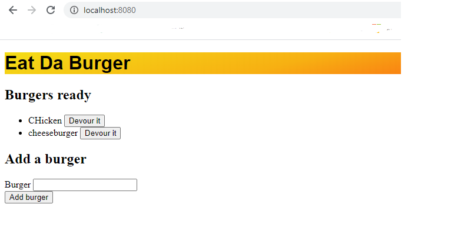

# 
Eat da Burger

 Create a backend server to create, read and update data from a MYSQL database.

*****
## 
Table of Contents

* [Installation](https://github.com/craigfbarry/burgers#installation)

* [Usage](https://github.com/craigfbarry/burgers#usage)

* [LIcense](https://github.com/craigfbarry/burgersr#license)

* [Contributing](https://github.com/craigfbarry/burgers#contributing)

* [Tests](https://github.com/craigfbarry/burgers#testing-framework)

* [Technologies Used](https://github.com/craigfbarry/burgers#technologies-used)

* [Author](https://github.com/craigfbarry/burgers#author)

* [Github URL](https://github.com/craigfbarry/burgers#github)

* [Acknowledgements](https://github.com/craigfbarry/burgersr#acknowledgements)

*****

#### Installation

        Run NPM start or open Heroku link.

#### Usage

Used as an example of MVC and front end reading data from MYSQL database

#### License

#### Contributing

none

#### Testing framework

        None

#### Technologies used

        Node NPM Heroku MYSQL sequelizer

#### Author

[@craigfbarry](https://github.com/craigfbarry/)

#### Github URL

https://github.com/craigfbarry/burgers

#### Acknowledgements

None

    